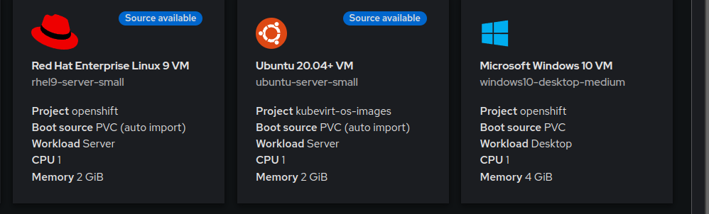

# openshift-virt-templates

## How to add other OS templates to Openshift Virtualization 

Download https://github.com/kubevirt/common-templates/releases/download/v0.25.0/common-templates.yaml (or relevant version, as specified in an existing Openshift Template, current 4.13 - v0.25.0)

Modify templates, for this example, only Ubuntu was selected.

Create DataSource and ImageCron to create the automatic import of source.

## Ubuntu Sample

```
oc new-project kubevirt-os-images
oc apply -f ubuntu-templates.yaml -n kubevirt-os-images
oc apply -f ubuntu-22.04-datasource.yaml -n kubevirt-os-images
oc apply -f ubuntu-22.04-imagecron.yaml -n kubevirt-os-images
```


